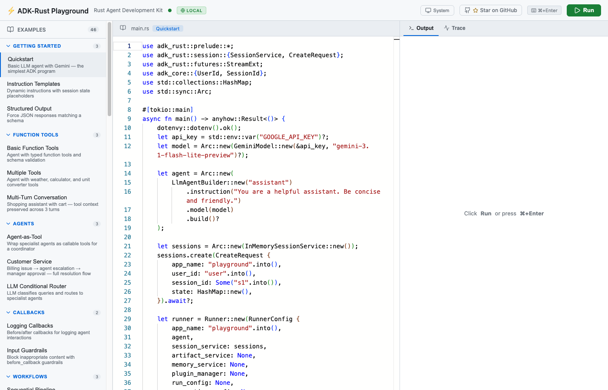
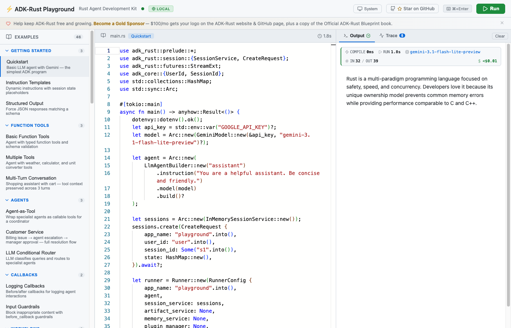
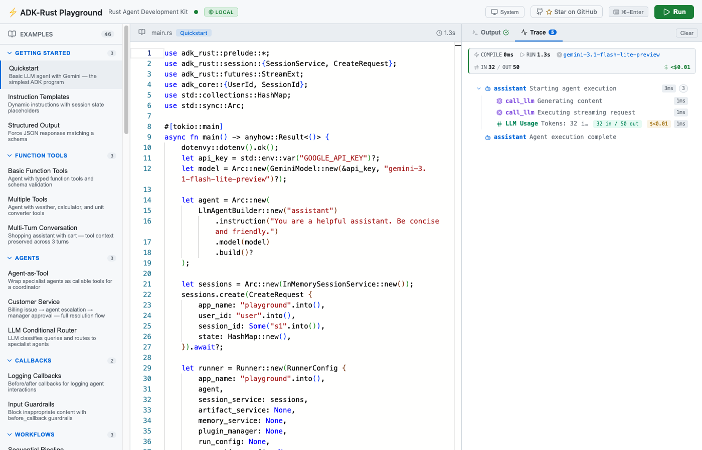
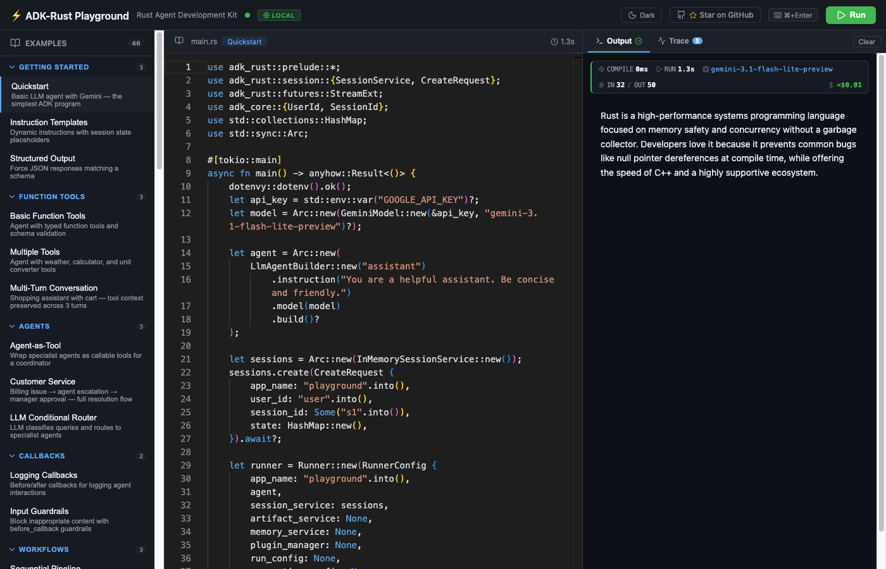

# ADK Playground

Examples, playground, and documentation validation for [ADK-Rust](https://github.com/zavora-ai/adk-rust) — the Rust Agent Development Kit.

## Try the Playground

The fastest way to explore ADK-Rust — no setup required:

👉 **[playground.adk-rust.com](https://playground.adk-rust.com)**

73 curated examples across 20 categories: agents, tools, thinking/reasoning, workflows, sessions, RAG, payments, multi-agent systems, and more. Mobile friendly.

| | |
|---|---|
|  |  |
| Code editor with 73 examples across 20 categories | Streaming output with model, tokens, and cost |
|  |  |
| Execution traces with LLM usage breakdown | Light and dark theme support |

Features:
- Live code editor with syntax highlighting
- Streaming output as your agent runs
- Execution traces showing the full agent → LLM → tool call tree
- Token usage and cost estimates per request
- Dark, light, and system themes
- Thinking/reasoning content display (Anthropic, DeepSeek, Gemini, OpenAI, xAI)
- Audio playback for TTS and realtime voice examples
- Mobile responsive layout

### Run locally

```bash
# Build the frontend
cd playground/frontend && npm install && npm run build && cd ../..

# Start the backend (serves frontend + runs examples)
cd playground/backend && cargo run --release
```

Then open http://localhost:9876.

## What's here

| Directory | Description |
|-----------|-------------|
| `playground/` | Web-based playground with live code editor, streaming output, and execution traces |
| `legacy-examples/` | 170+ runnable examples organized by provider and feature |
| `legacy-docs_examples/` | Compilable code snippets that validate the official documentation |

## Playground examples by category

**Getting Started** — Quickstart, instruction templates, structured output

**Function Tools** — Basic tools, multiple tools, multi-turn conversation

**Agents** — Agent-as-tool, customer service, LLM conditional router

**Callbacks** — Logging callbacks, input guardrails

**Workflows** — Sequential pipeline, parallel analysis, iterative loop

**Graph** — Graph pipeline, conditional routing, ReAct pattern, supervisor routing

**Sessions** — Session state, PostgreSQL, MongoDB, Neo4j

**Providers** — OpenAI, Anthropic, DeepSeek, Mistral, xAI/Grok, Azure AI, AWS Bedrock, OpenRouter

**Audio** — Poem → Speech TTS, realtime voice, session updates, Gemini Live

**Extensions** — Skill discovery, plugin system

**Coding** — Code execution sandbox, CLI launcher

**RAG** — Multi-collection, custom embedder

**Thinking** — OpenAI reasoning effort, Anthropic extended thinking, DeepSeek chain-of-thought, xAI Grok, Gemini thought signatures

**Advanced** — Artifact storage, long-term memory, advanced guardrails, RBAC access control

**Security** — Typed identity, audit trail, SSO & JWT

**Built-in Tools** — Google Search (Gemini), Web Search (Anthropic), Web Search (OpenAI)

**Payments** — Checkout agent, payment guardrails, shopping agent

**Competitive** — Auto-provider + encryption, durable graph resume, tool search filter

**Anthropic** — Prompt caching, vision, structured extraction, streaming + tools, token counting, multi-tool, thinking graph

**Action Nodes** — Data enrichment, smart ticket router, content pipeline

## Legacy examples

170+ standalone examples in `legacy-examples/` covering providers, tools, RAG, eval, realtime, UI, and more:

```bash
# Gemini quickstart (default provider)
GOOGLE_API_KEY=your_key cargo run -p quickstart

# OpenAI
OPENAI_API_KEY=your_key cargo run -p openai_basic

# Anthropic
ANTHROPIC_API_KEY=your_key cargo run -p anthropic_quickstart

# DeepSeek
DEEPSEEK_API_KEY=your_key cargo run -p deepseek_basic

# Multi-agent research assistant
cargo run -p ralph

# Audio pipeline (STT/TTS)
cargo run -p audio
```

## Environment variables

Create a `.env` file or set these in your shell:

```
GOOGLE_API_KEY=...
OPENAI_API_KEY=...
ANTHROPIC_API_KEY=...
DEEPSEEK_API_KEY=...
XAI_API_KEY=...
MISTRAL_API_KEY=...
OPENROUTER_API_KEY=...
```

## Requirements

- Rust 1.85+ (edition 2024)
- Node.js 18+ (for the playground frontend)
- API keys for the providers you want to use

## Request an example

Want to see a specific example? [Open an issue](https://github.com/zavora-ai/adk-rust/issues/new?template=example_request.yml) using the Example Request template.

## License

Apache-2.0
