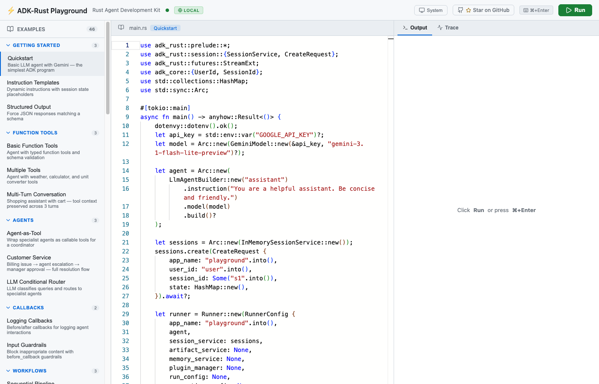
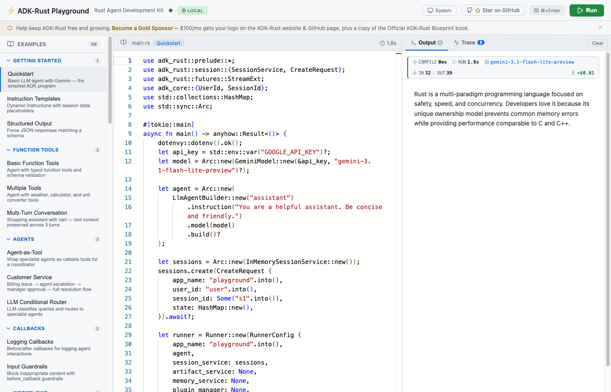
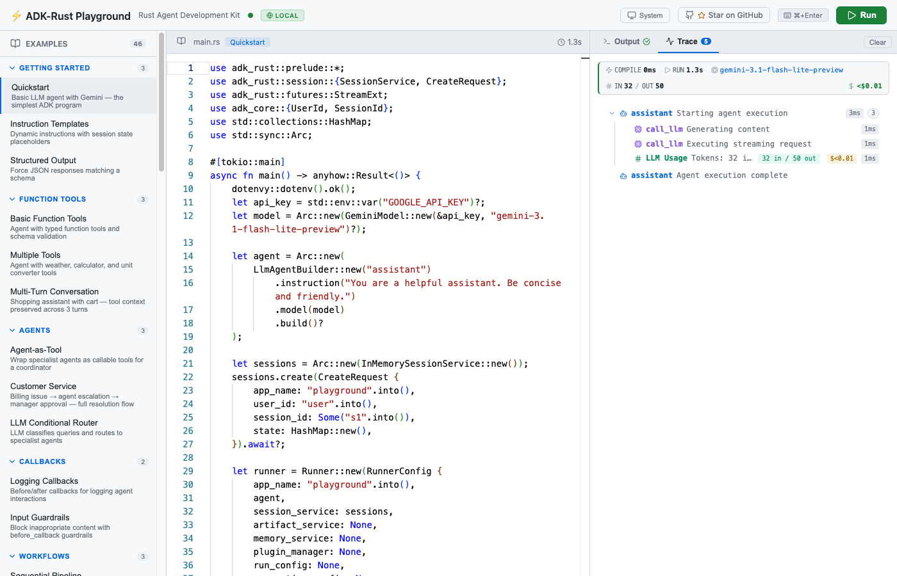
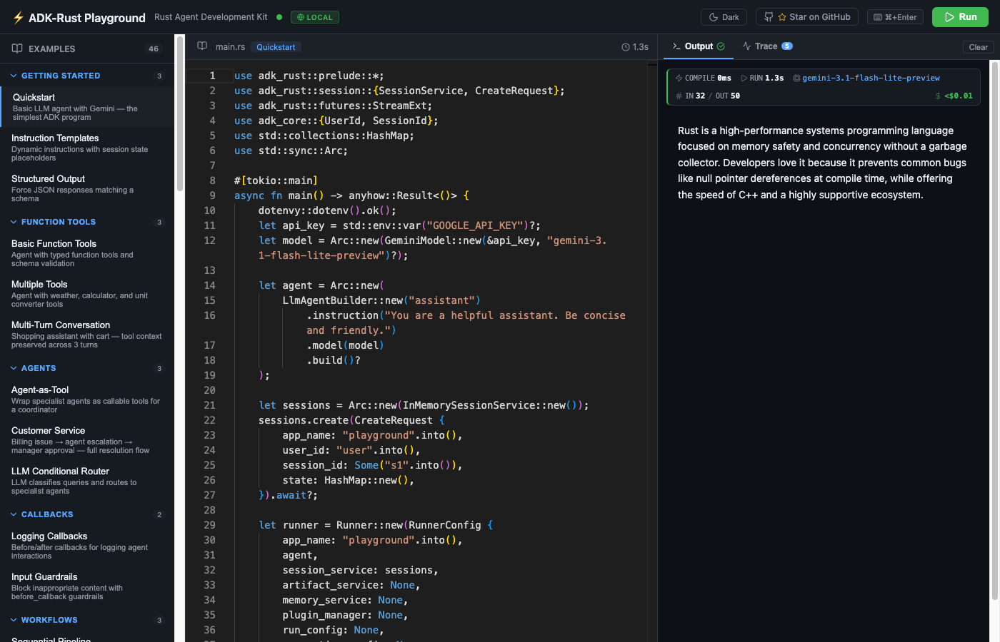

# ADK Playground

Examples, playground, and documentation validation for [ADK-Rust](https://github.com/zavora-ai/adk-rust) — the Rust Agent Development Kit.

## Try the Playground

The fastest way to explore ADK-Rust — no setup required:

👉 **[playground.adk-rust.com](https://playground.adk-rust.com)**

78 curated examples across 21 categories: agents, tools, thinking/reasoning, workflows, sessions, RAG, payments, multi-agent systems, and more. Mobile friendly.

| | |
|---|---|
|  |  |
| Code editor with 78 examples across 21 categories | Streaming output with model, tokens, and cost |
|  |  |
| Execution traces with LLM usage breakdown | Light and dark theme support |

Features:
- Live code editor with syntax highlighting
- Streaming output as your agent runs
- Execution traces showing the full agent → LLM → tool call tree
- Token usage and cost estimates per request
- Dark, light, and system themes
- Thinking/reasoning content display (Anthropic, DeepSeek, Gemini, OpenAI, xAI)
- Audio playback for TTS and realtime voice examples
- Mobile responsive layout
- Deep links — share any example via URL hash (e.g., `#quickstart`)

### Run locally

```bash
# Build the frontend
cd playground/frontend && npm install && npm run build && cd ../..

# Start the backend (serves frontend + runs examples)
cd playground/backend && cargo run --release
```

Then open http://localhost:9876.

## All Examples

Every example links directly to the live playground. Click to open.

### Getting Started

| Example | Description |
|---------|-------------|
| [Quickstart](https://playground.adk-rust.com/#quickstart) | Basic LLM agent with Gemini — the simplest ADK program |
| [Instruction Templates](https://playground.adk-rust.com/#template) | Dynamic instructions with session state placeholders |
| [Structured Output](https://playground.adk-rust.com/#structured_output) | Force JSON responses matching a schema |

### Function Tools

| Example | Description |
|---------|-------------|
| [Basic Function Tools](https://playground.adk-rust.com/#function_tool) | Agent with typed function tools and schema validation |
| [Multiple Tools](https://playground.adk-rust.com/#multi_tools) | Agent with weather, calculator, and unit converter tools |
| [Multi-Turn Conversation](https://playground.adk-rust.com/#multi_turn) | Shopping assistant with cart — tool context preserved across 3 turns |

### Agents

| Example | Description |
|---------|-------------|
| [Agent-as-Tool](https://playground.adk-rust.com/#agent_tool) | Wrap specialist agents as callable tools for a coordinator |
| [Customer Service](https://playground.adk-rust.com/#customer_service) | Billing issue → agent escalation → manager approval — full resolution flow |
| [LLM Conditional Router](https://playground.adk-rust.com/#conditional_router) | LLM classifies queries and routes to specialist agents |

### Callbacks

| Example | Description |
|---------|-------------|
| [Logging Callbacks](https://playground.adk-rust.com/#callbacks_logging) | Before/after callbacks for logging agent interactions |
| [Input Guardrails](https://playground.adk-rust.com/#callbacks_guardrails) | Block inappropriate content with before_callback guardrails |

### Workflows

| Example | Description |
|---------|-------------|
| [Sequential Pipeline](https://playground.adk-rust.com/#sequential) | Chain agents in a multi-step pipeline (research → write → edit) |
| [Parallel Analysis](https://playground.adk-rust.com/#parallel) | Run multiple agents concurrently and merge results |
| [Iterative Loop](https://playground.adk-rust.com/#loop_workflow) | Refine content in a loop until quality threshold is met |

### Graph

| Example | Description |
|---------|-------------|
| [Graph Pipeline](https://playground.adk-rust.com/#graph_workflow) | Analyst → Writer → Editor agents in a sequential graph |
| [Conditional Routing](https://playground.adk-rust.com/#graph_conditional) | LLM classifier routes support tickets to specialist agents via conditional edges |
| [ReAct Pattern](https://playground.adk-rust.com/#react_pattern) | Iterative reasoning with tools in a graph cycle |
| [Supervisor Routing](https://playground.adk-rust.com/#supervisor_routing) | Supervisor delegates tasks to specialist agent nodes |

### Sessions & State

| Example | Description |
|---------|-------------|
| [Session & State](https://playground.adk-rust.com/#session_state) | Manage conversation sessions with Runner and state |
| [PostgreSQL Sessions](https://playground.adk-rust.com/#postgres_sessions) | ACID-compliant session persistence with PostgreSQL |
| [MongoDB Sessions](https://playground.adk-rust.com/#mongodb_sessions) | Schema-flexible document sessions with MongoDB |
| [Neo4j Sessions](https://playground.adk-rust.com/#neo4j_sessions) | Graph-powered session relationships with Neo4j |

### Model Providers

| Example | Description |
|---------|-------------|
| [OpenAI](https://playground.adk-rust.com/#openai_quickstart) | Responses API — o4-mini reasoning with configurable effort + tool use |
| [Anthropic](https://playground.adk-rust.com/#anthropic_quickstart) | Claude Sonnet 4.5 with extended thinking (10K budget) + code review |
| [DeepSeek](https://playground.adk-rust.com/#deepseek_quickstart) | DeepSeek Reasoner with chain-of-thought for math & logic |
| [Mistral](https://playground.adk-rust.com/#mistral_quickstart) | Mistral Medium — multilingual translation + sentiment tools |
| [xAI (Grok)](https://playground.adk-rust.com/#xai_quickstart) | Grok-3-mini-fast debugging assistant with tool use |
| [Azure AI](https://playground.adk-rust.com/#azure_ai_quickstart) | Azure AI Inference endpoint — text classification + summarization |
| [AWS Bedrock](https://playground.adk-rust.com/#bedrock_quickstart) | Amazon Bedrock with Claude — cloud architecture design via IAM auth |
| [OpenRouter](https://playground.adk-rust.com/#openrouter_quickstart) | Multi-provider AI gateway — 200+ models with automatic fallback |

### Audio

| Example | Description |
|---------|-------------|
| [Poem → Speech](https://playground.adk-rust.com/#poem_tts) | LLM writes a random poem, Gemini TTS synthesizes it to audio |
| [Realtime Voice](https://playground.adk-rust.com/#realtime_audio) | OpenAI Realtime API — text prompt to expressive voice audio via WebSocket |
| [Realtime Session Update](https://playground.adk-rust.com/#realtime_session_update) | Mid-session persona switch — general assistant → travel agent |
| [Realtime Tools](https://playground.adk-rust.com/#realtime_tools) | Function calling in voice — weather, calculator, and time tools |
| [Gemini Live Tools](https://playground.adk-rust.com/#gemini_live_tools) | Gemini Live voice agent with weather + time tools |
| [Gemini Live Context Switch](https://playground.adk-rust.com/#gemini_live_context) | Mid-session persona switch via session resumption |

### Extensions

| Example | Description |
|---------|-------------|
| [Skill Discovery](https://playground.adk-rust.com/#skill_discovery) | Discover, parse, score, and inject agentskills.io skill files into prompts |
| [Plugin System](https://playground.adk-rust.com/#plugin_system) | Lifecycle hooks for agents — message, model, tool, and run callbacks |

### Coding

| Example | Description |
|---------|-------------|
| [Code Execution](https://playground.adk-rust.com/#code_execution) | Typed sandbox with truthful capability model — policy validation and CodeTool |
| [CLI Launcher](https://playground.adk-rust.com/#cli_launcher) | Deploy agents as interactive REPL or HTTP server with streaming |

### RAG

| Example | Description |
|---------|-------------|
| [Multi-Collection RAG](https://playground.adk-rust.com/#rag_multi_collection) | Domain-isolated knowledge bases with cross-collection search |
| [Custom Embedder](https://playground.adk-rust.com/#rag_custom_embedder) | Implement EmbeddingProvider trait — TF-IDF example with cosine similarity |

### Thinking / Reasoning

| Example | Description |
|---------|-------------|
| [Reasoning Effort (OpenAI)](https://playground.adk-rust.com/#thinking_openai) | o4-mini — Low/Medium/High reasoning effort + detailed summaries |
| [Extended Thinking (Anthropic)](https://playground.adk-rust.com/#thinking_anthropic) | Claude's internal reasoning with 10K token budget |
| [Chain-of-Thought (DeepSeek)](https://playground.adk-rust.com/#thinking_deepseek) | Visible chain-of-thought — watch the model think through math |
| [Grok Thinking (xAI)](https://playground.adk-rust.com/#thinking_xai) | Grok-3-mini thinks through Fermi estimation with tools |
| [Thought Signatures (Gemini)](https://playground.adk-rust.com/#thinking_gemini) | Native thinking traces + thought_signature on tool calls |

### Advanced

| Example | Description |
|---------|-------------|
| [Artifact Storage](https://playground.adk-rust.com/#artifact_agent) | Agent with versioned file storage — save, load, and list artifacts |
| [Long-Term Memory](https://playground.adk-rust.com/#memory_agent) | Cross-session memory recall — agent remembers past conversations |
| [Advanced Guardrails](https://playground.adk-rust.com/#guardrails_advanced) | PII redaction, content filtering, and GuardrailSet |
| [RBAC Access Control](https://playground.adk-rust.com/#auth_rbac) | Role-based tool permissions — analyst vs admin access |

### Security

| Example | Description |
|---------|-------------|
| [Typed Identity](https://playground.adk-rust.com/#auth_identity) | Injection-proof identity system — validated IDs, multi-tenant isolation |
| [Audit Trail](https://playground.adk-rust.com/#auth_audit) | Tamper-evident access logging — RBAC, AuditSink, AuthMiddleware |
| [SSO & JWT](https://playground.adk-rust.com/#auth_sso) | Enterprise identity — Google/Azure/Okta SSO, JWT validation, OIDC |

### Built-in Tools

| Example | Description |
|---------|-------------|
| [Google Search (Gemini)](https://playground.adk-rust.com/#builtin_gemini) | GoogleSearchTool — server-side search with grounding metadata |
| [Web Search (Anthropic)](https://playground.adk-rust.com/#builtin_anthropic) | WebSearchTool for Claude — server-side search with local tools |
| [Web Search (OpenAI)](https://playground.adk-rust.com/#builtin_openai) | OpenAIWebSearchTool — hosted search with local function tools |

### Payments

| Example | Description |
|---------|-------------|
| [Checkout Agent](https://playground.adk-rust.com/#payments_checkout) | AI-driven checkout lifecycle — session, fulfillment, authorization |
| [Payment Guardrails](https://playground.adk-rust.com/#payments_guardrails) | Amount thresholds, merchant allowlists, card/PII redaction |
| [Shopping Agent](https://playground.adk-rust.com/#payments_agent) | LLM agent with checkout tools — browse, cart, guardrail-enforced payment |

### Competitive

| Example | Description |
|---------|-------------|
| [Auto-Provider + Encryption](https://playground.adk-rust.com/#competitive_auto_provider) | provider_from_env() auto-detects API keys + AES-256-GCM encrypted sessions |
| [Durable Graph Resume](https://playground.adk-rust.com/#competitive_graph_resume) | MemoryCheckpointer — resume from checkpoint after crash |
| [Tool Search Filter](https://playground.adk-rust.com/#competitive_tool_search) | ToolSearchConfig regex — hide dangerous tools from the LLM |

### Anthropic Features

| Example | Description |
|---------|-------------|
| [Prompt Caching](https://playground.adk-rust.com/#anthropic_caching) | Multi-turn with cache creation (25% surcharge) then cache hit (90% discount) |
| [Vision Agent](https://playground.adk-rust.com/#anthropic_vision) | Image analysis — Claude sees images via URL with structured observations |
| [Structured Extraction](https://playground.adk-rust.com/#anthropic_structured) | Typed JSON extraction from unstructured text |
| [Streaming + Tools](https://playground.adk-rust.com/#anthropic_streaming) | Real-time streaming with mid-stream tool calls |
| [Token Counting & Models](https://playground.adk-rust.com/#anthropic_token_counting) | Model discovery, pre-flight token counting, cost estimation |
| [Multi-Tool Agent](https://playground.adk-rust.com/#anthropic_multi_tool) | Travel assistant — parallel tool orchestration |
| [Thinking Graph](https://playground.adk-rust.com/#anthropic_thinking_graph) | Extended thinking in a StateGraph — thinker → summarizer pipeline |

### Action Nodes

| Example | Description |
|---------|-------------|
| [Data Enrichment](https://playground.adk-rust.com/#action_set_transform) | SET + TRANSFORM action nodes prep data for LLM agent |
| [Smart Ticket Router](https://playground.adk-rust.com/#action_switch_loop) | LLM classifier + SWITCH routing + specialist agents |
| [Content Pipeline](https://playground.adk-rust.com/#action_workflow) | SET → Research → TRANSFORM → Writer → SWITCH → Editor |

### v0.7+ Features

| Example | Description |
|---------|-------------|
| [DeepSeek V4 Thinking](https://playground.adk-rust.com/#deepseek_v4_thinking) | ThinkingMode, ReasoningEffort — V4 Flash/Pro with visible chain-of-thought |
| [Project-Scoped Memory](https://playground.adk-rust.com/#project_scoped_memory) | project_id isolates memories per project — zero cross-project leakage |
| [Bounded Execution](https://playground.adk-rust.com/#bounded_execution) | RunConfig with history_max_events and max_tool_concurrency |
| [AWP Agent Discovery](https://playground.adk-rust.com/#awp_discovery) | Agentic Web Protocol — capability manifests, trust levels, rate limits |
| [Minimal Tier Agent](https://playground.adk-rust.com/#minimal_agent) | adk_rust::run() one-liner — 32% smaller builds with v0.8 minimal tier |

## Environment variables

Create a `.env` file or set these in your shell:

```
GOOGLE_API_KEY=...
OPENAI_API_KEY=...
ANTHROPIC_API_KEY=...
DEEPSEEK_API_KEY=...
XAI_API_KEY=...
MISTRAL_API_KEY=...
OPENROUTER_API_KEY=...
```

## Requirements

- Rust 1.85+ (edition 2024)
- Node.js 18+ (for the playground frontend)
- API keys for the providers you want to use

## Request an example

Want to see a specific example? [Open an issue](https://github.com/zavora-ai/adk-rust/issues/new?template=example_request.yml) using the Example Request template.

## License

Apache-2.0
